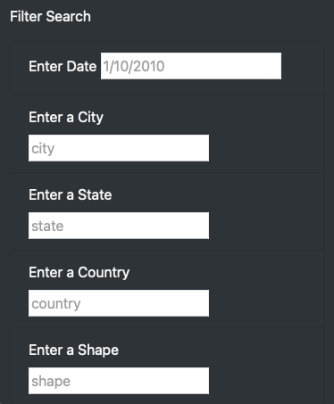

# UFOs
## Purpose
A web application that lists data of various UFO encounters around the world. The user may filter the data according to data, city, state, country, and/or the shape of the UFO. Additionally the table of data supplies the duration of the observation and further comments about it.

## Use
All of the data is initially listed on the page and the user may scroll through it at their leisure. Alternatively the user may use the filter options if looking for specific UFO observations:

Then user may enter filters into any or all boxes. The data will update upon pressing enter or clicking out of the text box.

### Filter Format
#### Date
The `Date` filter must be of the format `M/D/YYY`, where the month and the date are only expanded to two digits as necessary. For example January 1, 2010 *must* be entered as "1/1/2010" and not "01/01/2010"

#### State and Country
The `State` and the `Country` filters should only use abbreviations: "us" for the United States, and "ca" for Canada; "al" for Alabama, and "on" for Ontario.

#### All Text Boxes
All data entered into the City, State, Country, and Shape filters should be lowercase.

## Summary

### Drawback
The `Date` filter is currently set to compare strings, not a `datetime` format. This is the reason for the above formatting.

### Recommendations
There are two recommendations to improve this web application:

1. Adjust the `Date` filter to search for a range of dates.
2. Add a `Comment` filter that allows the user to search for keywords in the `Comments` column.